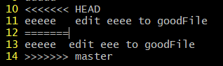
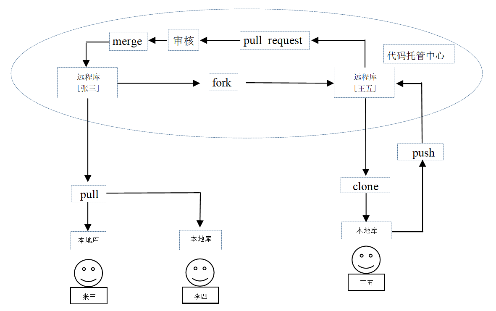
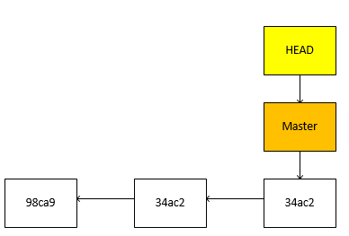
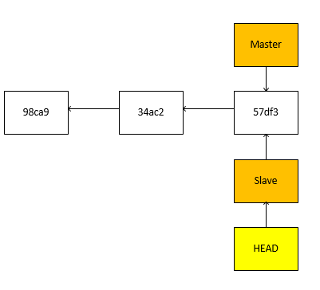
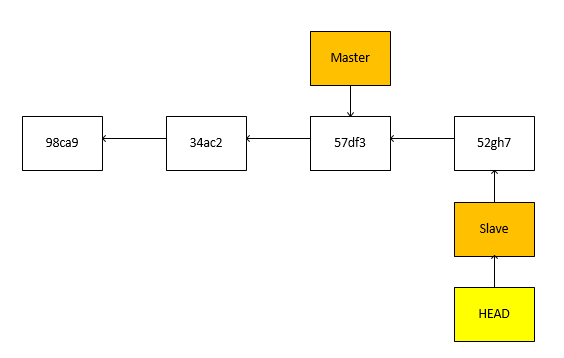
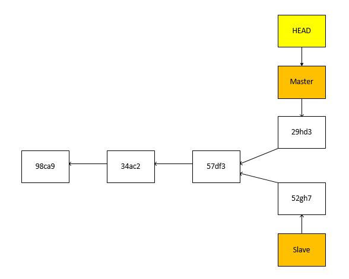

# 一、Git结构

工作区：写代码的地方

暂存区：临时存储。打算提交但没提交，可以提交到本地库，也可以撤回来

本地库：储存历史版本

**工作区  --- git  add ---> 暂存区 --- git  commit ---> 本地库**

# 二、Git命令行操作

## 1、本地库操作

### **本地库初始化**

命令：git  init

效果：会在当前路径下生成一个.git目录

注意：.git目录下存放的是本地库相关文件和子目录

~~~javascript
git init      //初始化。如果为空会提示 Initialized empty Git repository in xxx
~~~

### **设置签名**

形式：用户名、Email地址

作用：区分不同开发人员的身份。这里的签名和登录远程库时的账号密码没有关系

命令：

项目级别/仓库级别：仅在当前本地库有效

~~~javascript
git config user.name chen
git config user.email 1349170106@qq.com

//查看(在当前目录下)
cat .git/config
~~~

系统用户级别：登录当前操作系统的用户范围

~~~javascript
git config --global user.name chen
user.email 1349170106@qq.com

//查看(在系统用户目录下)
cd ~	//到当前用户目录
ls -a|less		//查看隐藏文件，有个.gitconfig目录		按q退出
cat .gitconfig
~~~

级别优先级：项目级别优先于系统用户级别。不能同时没有这两个级别的签名

### **基本操作**

~~~javascript
git  status   // 查看工作区/暂存区的状态
    提示：
        on branch master   //在master分支上
        No commits yet		//当前没有提交的操作（就是本地库没有任何提交）
        nothing to commit	//没有什么可以提交（就是暂存区没东西）
        untracked files		//未追踪的文件（可以提交到暂存区的文件）
~~~

~~~javascript
git add	[文件名]	//将文件从工作区提交到暂存区
	例：git add good.txt

git rm --cached [文件名]		//将文件从暂存区撤回到工作区
	例：git rm --cached good.txt
~~~

~~~~javascript
git commit -m "commit message" [文件名]		//将文件从暂存区提交到本地库
	例：git commit good.txt
	   输入要提交的信息
       或直接
       git commit -m '要提交的信息' good.txt
~~~~

### 查看历史记录

~~~javascript
git log		// 查看版本记录	HEAD指向哪里，就代表当前是哪个版本

//或者一条记录显示一行
git log --pretty=oneline

//或者显示缩短的Hash值(只显示老版本，不显示比当前版本新的版本)
git log --oneline

//或者显示回退到某个版本需要移动几步【推荐】
git reflog		// 显示的结果中会有一个参数HEAD@{x}，代表回退到这个版本需要移动x步
~~~

多屏显示控制方式(就是一页显示不完)

​	空格向下翻页

​	b向上翻页

​	q退出

### 版本的前进和后退

1、基于索引值操作【推荐】

~~~javascript
git reset --hard [版本的hsah值]
	例：git reset --hard 50dc8be
       cat [file name]		//查看操作后的内容
~~~

2、使用 ^ 符号操作

**只能后退到老版本**

~~~javascript
git reset --hard HEAD^		// 一个^符号代表回退一个版本
~~~

3、使用 ~ 符号操作

**只能后退到老版本**

~~~javascript
git reset --hard HEAD~[n]
	例：git reset --hard HEAD~3		// 代表回退3个版本
~~~

**reset命令的三个参数对比**

~~~javascript
--soft参数
	仅仅在本地库移动HEAD指针
--mixed参数
	在本地库移动HEAD指针
    重置暂存区(比如删除文件并推送到暂存区了，使用这个参数就会回退到删除文件，还没推送到暂存区的状态)
--hard参数
	在本地库移动HEAD指针
    重置暂存区和工作区(比如删除文件并推送到暂存区了，使用这个参数就会回退到没有删除文件的时候)
~~~

### 删除文件并找回

1、添加到仓库的文件的删除找回

~~~javascript
// 前提是删除文件之前，文件已经被提交到仓库了
git reset --hard [版本的hsah值]
~~~

2、添加到暂存区的删除文件找回

~~~javascript
git reset --hard HEAD		// 因为--hard参数会重置暂存区和工作区
~~~

### **比较文件差异**

~~~javascript
// 都是同一文件不同版本之间进行比较
git diff [文件名]		// diff后面没带参数，代表工作区中的文件和暂存区中对应的文件进行比较
或
git diff [仓库中历史版本] [文件名]
	例：git diff HEAD [文件名]		// 代表工作区中的文件和仓库中的这个文件的某个版本进行比较
	   git diff HEAD^ [文件名]		// 代表工作区中的文件和仓库中的这个文件的某个历史版本进行比较
~~~

不带文件名，比较多个文件

~~~javascript
git diff HEAD		// 会列出多个文件的差异(还是同一文件不同版本之间进行比较)
~~~

### **分支管理**

分支：在版本控制过程中，使用多条线同时推进多个任务

好处：同时并行推进多个功能的开发。如果某个分支开发失败，不会对其它分支产生影响，失败的分支删除重新开			始即可。

**分支操作：**

1、查看所有分支

~~~javascript
// 显示的结果是分支名、当前hash值，提交的备注
// 有星号的那个分支是当前所在的分支
git branch -v
~~~

2、创建分支

~~~javascript
git branch [分支名]
~~~

3、切换分支

~~~javascript
git checkout [分支名]
~~~

4、合并分支

**要把B分支的内容合并到A分支上，当前所在分支必须是A分支**

~~~javascript
// 切换到A分支,这个分支名是A
git checkout [分支名]
// 合并分支，这个分支名是B
git merge [分支名]
~~~

5、解决分支冲突

如果同时对两个分支的同一个文件的同一处内容进行了不同的修改，在合并时就会产生冲突

上方就是合并冲突以后的文件，vim编辑，11行和13行提示的是冲突的内容，由人决定修改文件内容到满意程度，然后删除第10、12、14行内容，保存退出，再执行git  add  [文件名] 和 git commit  -m 操作，注意，其中git  commit  -m 操作不能带文件名

## 2、远程库操作

### 保存远程库地址

​	(这样就不用每次都输入一大串网址，使用别名即可)

~~~~java
git remote add 别名 远程库地址
    // 将 https://github.com/17734812911/studyGitHub.git 起别名 origin
    例：git remote add origin https://github.com/17734812911/studyGitHub.git

// 查看当前存在的远程库地址
git remote -v
    // 上面add执行过后，执行 -v 命令，会出现下面两行数据
	// origin  https://github.com/17734812911/studyGitHub.git (fetch)
	// origin  https://github.com/17734812911/studyGitHub.git (push)
	// origin表示别名  fetch表示这个地址用来取回  push表示这个地址用来推送
~~~~

### 推送数据到远程库

~~~java
git push 远程库地址(用别名) 要推送到的分支名
    例：git push origin master
    // 如果出现Username for 'https://github.com'：	表示要输入你的github的邮箱，确定以后输入		// github的登录密码
    // 上传以后提示   * [new branch]      master -> master
    // 				表示远程库新建的分支   从本地的master推送到远程库的master分支
~~~

### 克隆操作

克隆之前不需要执行 git  init 初始化操作

~~~java
git clone 远程仓库地址
    例：git clone https://github.com/17734812911/studyGitHub.git
~~~

git clone 命令有三个作用：

​	1、完整的把远程库下载到本地

​	2、创建origin远程地址别名

​	3、初始化本地库

### 邀请成员加入团队

另一个人克隆代码到本地，修改以后，无法从本地库直接将代码推送到团队的远程库，需要先邀请成员加入团队

**步骤：**

​		点击仓库名，页面中有个Settings，点击以后，左边列表中有个Manage  access选项，点击以后，页面中间有个invite a collaborator 按钮，点击以后输入要邀请加入团队的成员名，然后会有一个等待邀请的超链接，复制连接，打开同意加入即可。

### 远程库修改后拉取到本地

命令：git  pull  [远程库别名]  [远程库分支名]

git pull 功能相当于**git fetch** 和 **git merge**之和

~~~java
git fetch [远程库别名] [远程库分支名]	// 将远程库的内容下载到本地（下载后还不在工作区）
    git fetch origin master
git checkout origin/master	// git checkout切换分支。去这个目录下，再使用cat命令就可以看下载的内容
git checkout master			// 切换回本地master分支

git merge [远程库别名/远程库分支名]
git merge origin/master		// git merge合并分支。将origin/master分支合并到本地分支上
~~~

上面的效果和下面命令效果相同

~~~java
git pull origin master
~~~

### 协同开发时冲突的解决

当有人推送了一个新的版本到远程库后，如果另一个人没有pull（拉取）最新版，依然用旧版本进行修改，然后再推送到远程库，就会发生冲突，推送不到远程库中，这就是冲突。报下面的错误

~~~java
error: failed to push some refs to 'https://github.com/17734812911/studyGitHub.git'
hint: Updates were rejected because the remote contains work that you do
hint: not have locally. This is usually caused by another repository pushing
hint: to the same ref. You may want to first integrate the remote changes
hint: (e.g., 'git pull ...') before pushing again.
hint: See the 'Note about fast-forwards' in 'git push --help' for details.
~~~

解决方法：

~~~java
1.执行 git  pull  origin  master，拉取最新版本	origin是远程库地址别名   master是分支名
2.打开冲突的文件。删除特殊符号，协商将文件改为需要的样子
3.依次执行git add、git commit、git push等操作，将协商的文件推到远程库中（注意，其中git commit -m     操作不能带文件名）
~~~

### 跨团队之间的协作

使用 fork(派生) + pull  request 的方式可以实现跨团队协作

步骤：

~~~java
1、fork项目：张三或李四将远程库地址发送给王五，王五打开以后，在页面右上角(就是Star的旁边)，点击Fork按钮				即可
2、王五将项目clone到本地，然后进行修改
3、王五将修改后的项目推送到自己的远程库
4、王五在远程仓库页面中点击pull requests按钮,再点击右上角new pull request按钮，再
   点击Create pull request,然后输入要发送的消息，发送即可
5、张三进入远程仓库页面，点击pull requests按钮，再点击收到的消息，可以进行回复消息，也可以点击Commits按	 钮，看王五做了哪些提交，点击Files changed可以看具体的修改（就是审核代码）。
   如果审核没问题，可以点击Conversation，回到对话中，点击下方的Merge pull request按钮，准备合并王五提	  交的代码，填写合并信息，点击Confirm merge合并
~~~

# 三、Git基本原理

## 1、Git分支管理的本质是创建和移动指针

1. 最初时只有一个Master分支，HEAD指针指向Master分支

2. 当创建分支时，只是创建了一个Slave分支，然后将HEAD指针指向Slave，此时Master分支和Slave分支都指向同一个版本

3. 当在Slave分支上进行新的版本推送后，Slave分支指向了另一个版本，Master分支还是指向之前的版本

4. 当Master分支再提交时，Master分支和Slave分支指向不同的两个版本

# 四、报错及处理

1、远程仓库删除文件以后再推送一个同名文件报下列错误

~~~java
error: failed to push some refs to 'https://github.com/17734812911/studyGitHub.git'
hint: Updates were rejected because the tip of your current branch is behind
hint: its remote counterpart. Integrate the remote changes (e.g.
hint: 'git pull ...') before pushing again.
hint: See the 'Note about fast-forwards' in 'git push --help' for details.
~~~

解决：

~~~java
git pull origin master --allow-unrelated-histories	// origin为远程库别名  master为远程分支名
git pull origin master
git init
git add [文件名]
git commit -m "信息"
git push -u origin master
~~~

